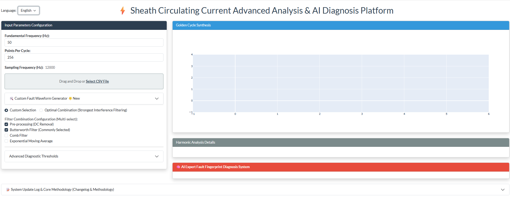
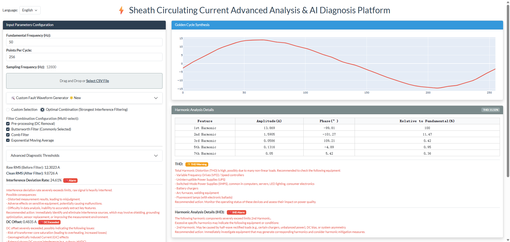
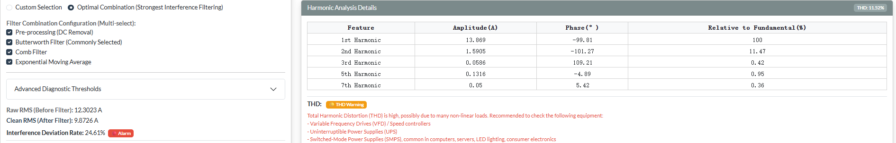
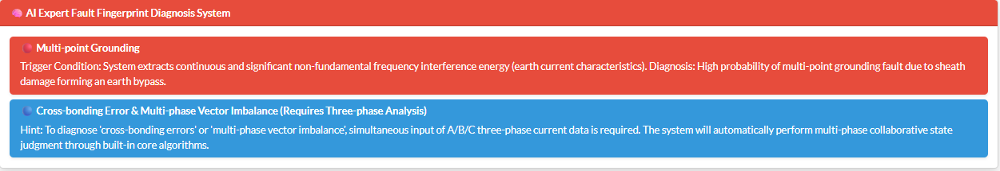
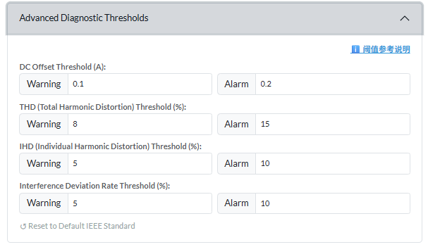
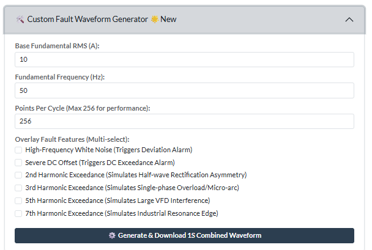

# ⚡ Cable Sheath Circulating Current Deep Processing & AI Diagnosis Platform - Product Manual

## 1. Product Overview

**The Cable Sheath Circulating Current Deep Processing & AI Diagnosis Platform** is a comprehensive intelligent software specifically designed for condition monitoring and health assessment of high-voltage/extra-high-voltage (HV/EHV) cables.

> 🖼️ **[ 1: Global View of Platform Main Interface]**
> 

In complex power site environments, cable sheath circulating current signals are often mixed with a large amount of environmental interference, harmonics, and DC components. By introducing cutting-edge Digital Signal Processing (DSP) technology and establishing an AI expert diagnosis matrix, this platform can "extract the silk from the cocoon" from chaotic raw waveforms, accurately extract core electrical features reflecting the true health status of the cable, and automatically output highly valuable fault diagnosis conclusions.

This platform serves not only as a "digital microscope" for O&M personnel but also as a "virtual expert" for decision-making assistance.

---

## 2. Core Functional Features

### 1. 🎛️ Multi-dimensional Signal Deep Cleaning & Automatic Optimization

> 🖼️ **[ 2: Waveform Comparison Before and After Filtering & Optimization Panel]**
> 

*Image suggestion: Screenshot the "Data Quality Metrics" module on the platform interface, and the table for "Feature Spectrum Analysis".*

Addressing complex electromagnetic interference on site, the platform has built-in multiple professional-grade digital filters. The system can **automatically calculate and match the best filter combination** based on the uploaded waveform data, maximizing the restoration of the true sheath circulating current signal and providing a pure data source for subsequent analysis.

### 2. 📊 High-Dimensional Electrical Feature Intelligent Extraction

> 🖼️ **[Image Placeholder 3: Metric Cards & Harmonic Analysis Table]**
> 

*Image suggestion: Screenshot the "Data Quality Metrics" module on the platform interface, and the table for "Feature Spectrum Analysis".*

Beyond traditional single current effective value (RMS) monitoring, the platform can comprehensively extract deep features:
*   **Interference Deviation Rate Assessment**: Quantify the pollution degree of site noise on the true signal.
*   **DC Bias Analysis**: Accurately extract hidden minute DC components.
*   **Panoramic Harmonic Analysis**: Automatically generate the "Golden Cycle" for high-precision FFT, accurately analyzing the amplitude, phase, Total Harmonic Distortion (THD), and Individual Harmonic Distortion (IHD) of the fundamental and each harmonic.

### 3. 🧠 Heuristic AI Expert Diagnosis System

> 🖼️ **[Image Placeholder 4: Expert Diagnosis Conclusion Output Area]**
> 

*Image suggestion: Screenshot the "AI Expert Diagnosis Conclusion" module at the bottom. Show a state where a specific fault is detected to reflect the final business value of the system.*

The platform not only "discovers problems" but also "explains problems." With a built-in multi-dimensional expert diagnosis matrix, it can automatically diagnose up to 18 types of underlying software and hardware faults through the combination and judgment of "feature fingerprints," just like an experienced power expert.
The platform can accurately locate and prompt the following typical hidden dangers (including but not limited to):
*   Cross-bonding box wiring anomaly / poor contact
*   Sheath open circuit / sheath damage
*   Grounding box water ingress and dampness
*   Sheath multi-point grounding, etc.

### 4. ⚙️ Dynamic Threshold & Multi-level Warning Engine

> 🖼️ **[Image Placeholder 5: Advanced Threshold Configuration Panel]**
> 

It supports O&M personnel to "hot modify" various security thresholds on the front-end interface. The platform can respond in real-time, score the health of each indicator, and trigger text alarms through eye-catching visual tags (Badges), realizing early discovery and early intervention of hidden dangers.

### 5. 🛠️ Composite Fault Waveform Simulator (Sandbox Verification)

> 🖼️ **[Image Placeholder 6: Waveform Simulator Configuration Area]**
> 

To facilitate scientific research training and algorithm verification, the platform has a built-in powerful "One-click Waveform Generator." Without real equipment, users can freely combine and set the fundamental current, DC bias, various proportions of high-order harmonics, and random Gaussian noise to instantly generate high-fidelity composite fault waveforms.

---

## 3. Major Technical Highlights & Algorithm Applications (Core Confidential Level)

Without relying on a massive computing cluster, this platform achieves extremely high diagnostic efficiency through a clever combination of algorithms. Its main technical anchors include:

1.  **Composite Digital Signal Processing (DSP) Algorithm Stack**
    *   **IIR Comb Filtering Technology**: Accurately "combs out" specific frequency interference and retains useful frequency bands.
    *   **Improved Butterworth Low-pass Filtering**: Eliminates high-frequency clutter while ensuring that valid harmonics do not undergo phase distortion.
    *   **EMA (Exponential Moving Average) Algorithm**: Smooths sudden burrs and enhances the signal's anti-shock interference capability.

2.  **Steady-state Interception & "Golden Cycle" Reconstruction Algorithm**
    Adopts adaptive waveform zero-crossing detection and cycle alignment algorithms to accurately intercept and synthesize the **steady-state Golden Cycle**, ensuring extremely high accuracy of Fourier analysis from mathematical principles.

3.  **Multi-parameter Dimensionality Reduction & Expert Diagnosis Matrix**
    Adopts a **heuristic matrix with multi-feature joint mapping**. The system takes the extracted pure effective value, DC bias, and odd/even harmonic distortion rates as input vectors, and compares them with the "feature fingerprints" of specific faults through matrix weights, thereby realizing accurate classification and deduction of complex coupled faults.