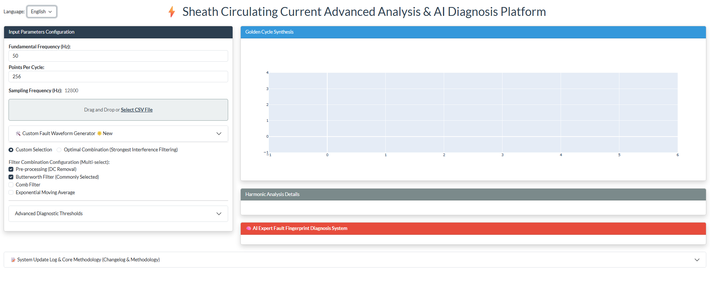
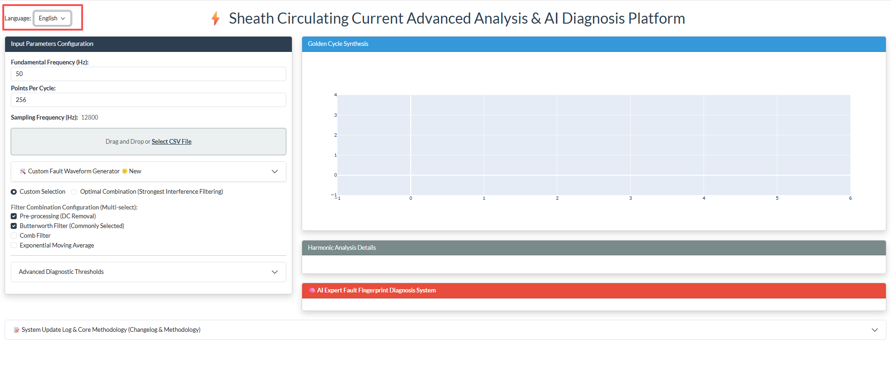
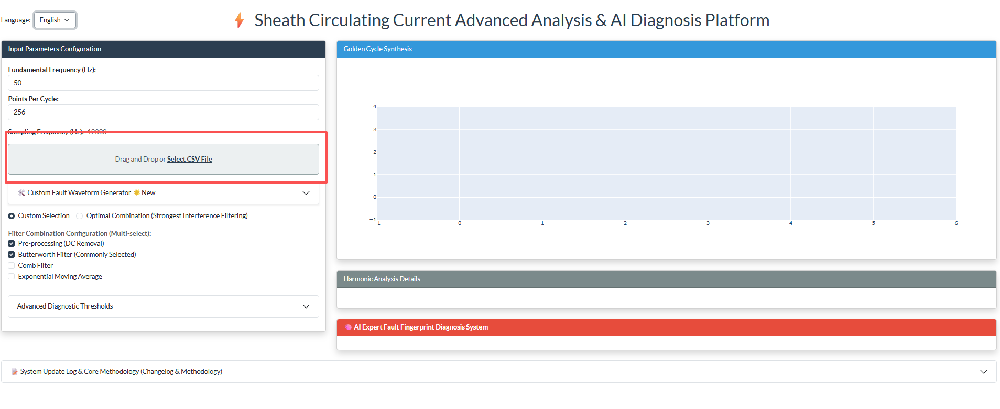
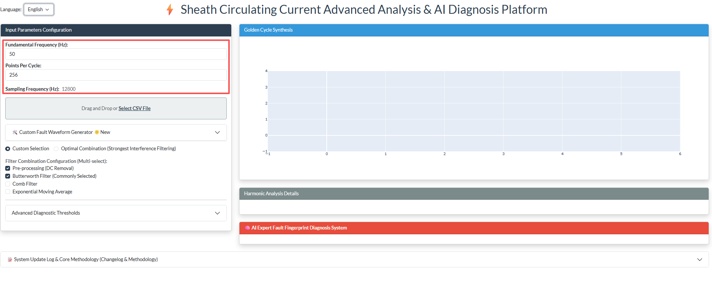
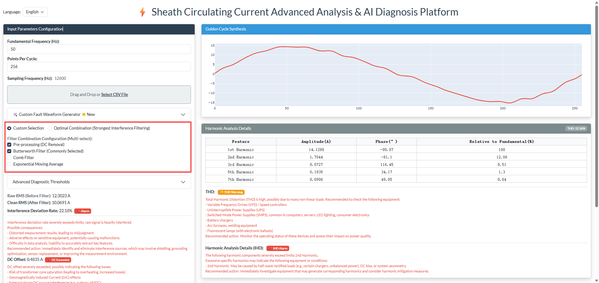
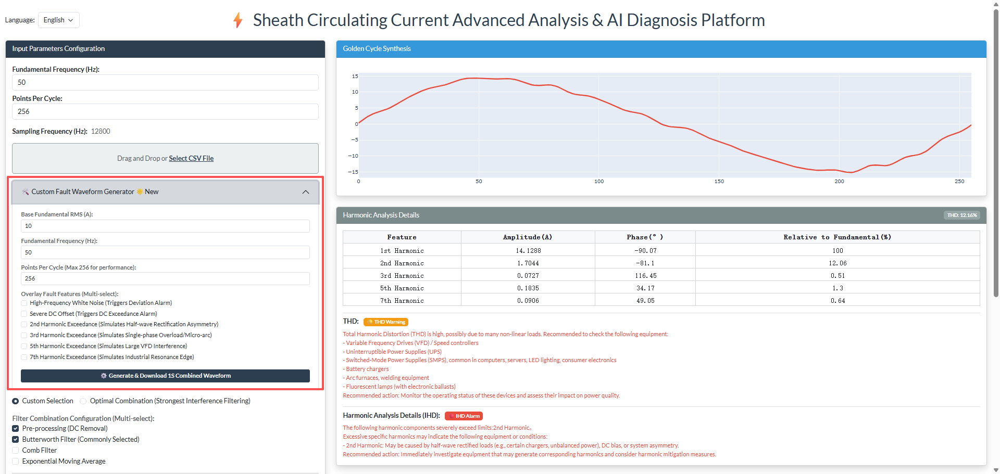
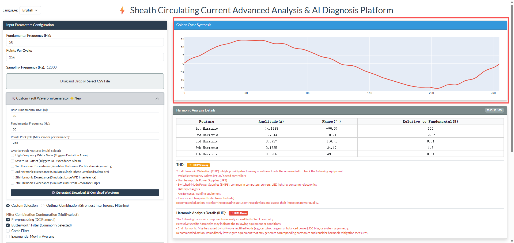
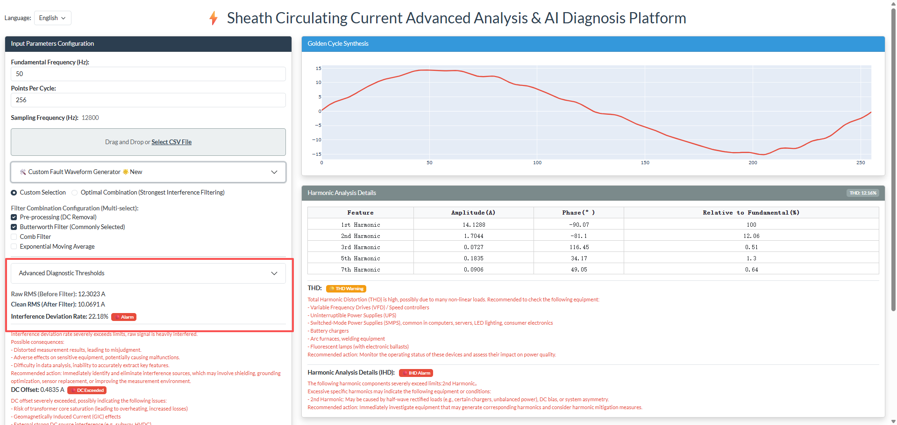
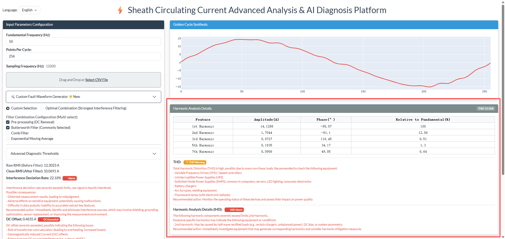
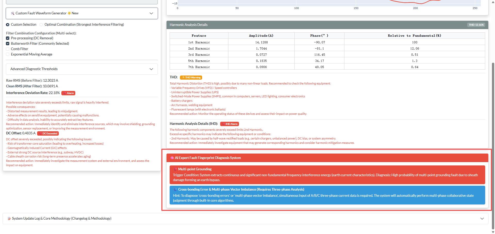

# 📖 Cable Sheath Circulation Deep Processing & AI Diagnosis Platform - User Manual

## 1. Preface

Welcome to the **Cable Sheath Circulation Deep Processing & AI Diagnosis Platform**! This platform is designed to help power O&M personnel, engineers, and researchers efficiently and accurately analyze High Voltage/Extra High Voltage (HV/EHV) cable sheath circulation data, identifying potential faults and operational anomalies.

This manual will provide detailed guidance on how to use the platform, from data upload to result interpretation, ensuring you can fully utilize its powerful analysis and diagnostic functions.

## 2. System Overview

This platform is an interactive Web application built on the Python Dash framework, integrating advanced Digital Signal Processing (DSP) technology and a heuristic AI expert system. It can deeply clean and extract features from the collected raw waveforms of cable sheath circulation and provide intelligent diagnostic conclusions based on these features, helping users quickly locate hidden dangers in cable systems.

## 3. Operating Environment Requirements

*   **Browser**: Modern browsers such as Google Chrome, Mozilla Firefox, and Microsoft Edge are recommended.
*   **Network**: Ensure your device can access the server IP address and port where the platform is deployed (e.g., `http://localhost:8051`).
---

## 4. Platform Operation Steps

### 4.1 Access the Platform

Enter the platform's URL address in your browser's address bar to enter the system.

> 🖼️ **[Image Placeholder 1: Platform Initial Access Interface]**
> 

### 4.2 Language Switching

The platform supports switching between Chinese and English. You can select the interface language according to your needs. Find the **"Language Selection"** dropdown menu in the upper right corner of the page, and click to select **"中文"** or **"English"**.

> 🖼️ **[Image Placeholder 2: Language Selection Dropdown Menu]**
> 

### 4.3 Upload Raw Data File

The platform accepts raw waveform data in standard **CSV format**.

*   **File Format Requirements**: The CSV file should only contain one column of data, which represents the raw current or voltage sampling values. The file **should NOT contain a header**.

1.  Find the upload box in the **"File Upload Area"** on the page.
2.  You can **drag and drop** your CSV file into this area, or click the **"Select File"** button to choose a file.
3.  After the file is successfully uploaded, the system will automatically start processing the data.

> 🖼️ **[Image Placeholder 3: File Upload Area]**
> 

### 4.4 Set Basic Parameters

Before data processing, please make sure to input the following basic parameters, as they will directly affect the accuracy of the analysis.

1.  **Grid Frequency (Freq)**: Enter the operating frequency of the power grid, usually `50` or `60` Hz.
2.  **Points Per Cycle (PPC)**: Enter the number of sampling points within each power grid cycle.
3.  **Calculated Sampling Frequency (Fs)**: This value will be automatically calculated and displayed based on your Freq * PPC. You do not need to input it manually.

> 🖼️ **[Image Placeholder 4: Basic Parameters Input Area]**
> 

### 4.5 Configure Filters (Signal Deep Processing)

The platform provides flexible filter configuration options. You can choose **Auto mode** to let the system recommend the best combination, or **Custom mode** to select manually.

1.  **Filter Mode Selection**:
    *   **Auto (自动)**：Recommended for first-time use. The platform will automatically and intelligently select the best combination of filters based on the characteristics of the data.
    *   **Custom (自定义)**：Experienced users can choose this mode to manually select the required filters (e.g., DC Removal, Butterworth Filter, Comb Filter, etc.).

> 🖼️ **[Image Placeholder 5: Filter Configuration Area]**
> 

### 4.6 Use Fault Waveform Simulator (Advanced Function)

The platform has a built-in powerful **Fault Waveform Simulator**, which can generate simulated waveforms with various fault characteristics without real data.

1.  Expand the **"Fault Waveform Simulator"** panel.
2.  Set the fundamental RMS value, frequency, and total sampling points.
3.  Check the fault types you want to superimpose on the fundamental wave (e.g., noise, DC offset, various harmonics).
4.  Click **"Generate and Download"**, and the system will generate a CSV file and automatically download it. You can re-upload it to the platform for analysis and verification.

> 🖼️ **[Image Placeholder 6: Fault Waveform Simulator Panel]**
> 

### 4.7 Configure Advanced Thresholds (Dynamic Adjustment)

You can dynamically adjust the warning and alarm thresholds for various indicators based on actual operational experience and standards. Expand the **"Advanced Alarm Threshold Configuration"** panel to modify the values, and the platform status will be updated in real-time according to your modifications.
---

## 5. Interpretation of Analysis Results

### 5.1 Golden Cycle Waveform Plot

At the top of the main interface is the **"Golden Cycle" waveform plot**, which is automatically extracted and synthesized by the system after digital signal processing. The red curve represents a clean, stable signal with most interferences removed.

> 🖼️ **[Image Placeholder 8: Main Waveform Display Area]**
> 

### 5.2 Core Metrics and Interference Deviation Rate

Below the waveform plot, you will see:
*   **Raw RMS & Pure RMS**: Reflects the difference in effective values before and after filtering.
*   **Interference Deviation Rate**: Quantifies the percentage deviation between the raw signal and the pure signal.
*   **DC Bias**: The size of the DC component in the sheath circulation signal.
*(Next to each indicator, there will be green "Normal," yellow "Warning," or red "Alarm" labels.)*

> 🖼️ **[Image Placeholder 9: Core Metrics Display Area]**
> 

### 5.3 Harmonic Analysis

The platform provides detailed harmonic analysis results:
*   **Total Harmonic Distortion (THD)**: The relative strength of all harmonic components in the entire signal relative to the fundamental wave.
*   **Harmonic Component Table**: Detailed listing of the amplitude, phase, and individual harmonic distortion (IHD) of the fundamental and each harmonic (2nd, 3rd, 5th, etc.).

> 🖼️ **[Image Placeholder 10: Harmonic Analysis Table and THD/IHD Display]**
> 

### 5.4 AI Expert Diagnosis Conclusion

Based on the extracted electrical features, the expert system will conduct an intelligent judgment and output specific fault diagnosis conclusions (e.g., sheath open circuit, multi-point grounding, etc.) in clear text at the bottom of the page, providing you with intuitive O&M guidance.

> 🖼️ **[Image Placeholder 11: AI Expert Diagnosis Conclusion Area]**
> 

---

## 6. Troubleshooting (FAQ)

*   **Q: An error is displayed on the page after uploading the CSV file.**
    *   **A**: Please check your CSV file format to ensure it contains only one column of data and **no header**.
*   **Q: The waveform plot is blank or abnormal.**
    *   **A**: Please confirm if the basic parameter (Frequency, PPC) settings are correct. Try switching the filter to "Auto" mode.
*   **Q: The diagnostic conclusion does not meet expectations.**
    *   **A**: Please check if your **Advanced Threshold** settings comply with your actual business standards.
---

## 7. Precautions

*   The diagnostic conclusions provided by this platform are for reference only. The final fault judgment and treatment still need to be combined with actual site conditions and the experience of professional personnel.
*   If you have any questions or encounter problems that cannot be solved, please contact technical support.

